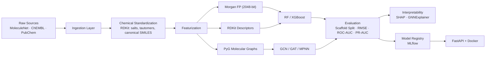

# 🧬 Molecular Property Prediction System

A production-grade, end-to-end machine learning platform for predicting molecular properties from chemical structures. Built as a comprehensive ML engineering portfolio piece demonstrating the full lifecycle—from raw data ingestion through model interpretability to Dockerized API deployment.

[](https://github.com/jitesh523/Molecular-Property-Prediction-System./actions)
[](https://python.org)
[](LICENSE)

---

## 🏗️ Architecture



---

## 📊 Datasets

| Dataset | Source | Task | Molecules | Endpoint |
|---------|--------|------|-----------|----------|
| ESOL (Delaney) | MoleculeNet | Regression | ~1,128 | Aqueous solubility (logS) |
| FreeSolv | MoleculeNet | Regression | ~643 | Hydration free energy |
| Lipophilicity | MoleculeNet | Regression | ~4,200 | Octanol/water partition (logD) |
| BBBP | MoleculeNet | Classification | ~2,039 | Blood-brain barrier permeability |
| ChEMBL EGFR | ChEMBL 36 | Regression | Variable | pIC50 inhibition potency |
| PubChem AID 260895 | PUG-REST | Regression | ~25 | erbB1 inhibition (IC50→pIC50) |

---

## 🤖 Model Zoo

### Baselines (Fingerprint-based)
| Model | Features | Library |
|-------|----------|---------|
| **Random Forest** | Morgan FP (2048-bit) | scikit-learn |
| **XGBoost** | Morgan FP (2048-bit) | XGBoost |

### Graph Neural Networks
| Model | Architecture | Library |
|-------|-------------|---------|
| **GCN** | Graph Convolutional Network (Kipf & Welling) | PyTorch Geometric |
| **GAT** | Graph Attention Network (Veličković et al.) | PyTorch Geometric |
| **MPNN** | Message Passing Neural Network (Gilmer et al.) | PyTorch Geometric |
| **Multi-Task GNN** | Shared backbone + per-task heads with NaN-masked loss | PyTorch Geometric |

All GNNs share a common base: 3–5 message passing layers → global mean pooling → 2-layer MLP head.

The **Multi-Task GNN** wraps any backbone (GCN/GAT/MPNN) with independent prediction heads per task, supporting mixed regression + classification endpoints and missing-label masking — essential for real pharma datasets like Tox21.

---

## 🚀 Quickstart

### 1. Environment Setup

```bash
# Clone the repository
git clone https://github.com/jitesh523/Molecular-Property-Prediction-System..git
cd Molecular-Property-Prediction-System.

# Create virtual environment
python -m venv .venv
source .venv/bin/activate

# Install dependencies
pip install -e .
pip install torch torch-geometric rdkit scikit-learn xgboost
pip install mlflow shap optuna fastapi uvicorn httpx
```

### 2. Data Pipeline

```bash
# Download MoleculeNet benchmark datasets
python scripts/download_molnet_datasets.py

# Process and standardize
python -c "
from molprop.data.processor import process_all_benchmark_datasets
from pathlib import Path
process_all_benchmark_datasets(Path('data/raw'), Path('data/processed'))
"

# (Optional) Ingest external databases
python src/molprop/data/ingest_chembl.py   # ChEMBL EGFR target
python src/molprop/data/ingest_pubchem.py  # PubChem AID 260895
```

### 3. Train Models

```bash
# Baselines (RF + XGBoost)
python scripts/run_baselines.py --dataset delaney --task regression
python scripts/run_baselines.py --dataset bbbp --task classification --explain

# GNN Training (uses Hydra config)
python scripts/train_gnn.py model=gcn dataset=delaney
python scripts/train_gnn.py model=gat dataset=bbbp
python scripts/train_gnn.py model=mpnn dataset=delaney
```

### 4. Hyperparameter Tuning (Optuna)

```bash
# Baseline HPO
python scripts/tune_baselines.py --dataset delaney --task regression --model rf --n-trials 50
python scripts/tune_baselines.py --dataset bbbp --task classification --model xgb --n-trials 50

# GNN HPO
python scripts/tune_gnn.py --dataset delaney --task regression --model gcn --n-trials 30
```

### 5. Generate Benchmark Tables

```bash
python scripts/generate_benchmark.py --skip-gnn  # baselines only
python scripts/generate_benchmark.py              # all models (requires trained weights)
```

### 6. Ablation Study (Fingerprint vs Graph)

```bash
# Compare all representation × model combinations
python scripts/run_ablation.py --dataset delaney --task regression
python scripts/run_ablation.py --dataset bbbp --task classification
# Results: results/ablation/ablation_chart_*.png + ablation_*.csv
```

### 7. Multi-Task Training

```bash
# Train a shared GNN backbone with per-task prediction heads
python scripts/train_multitask.py model=multitask dataset=bbbp
```

### 8. Inference API

```bash
# Run locally
uvicorn molprop.serving.api:app --reload

# Or via Docker
docker build -t molprop-api .
docker run -p 8000:8000 molprop-api
```

#### Example: Single Prediction

```bash
curl -X POST http://localhost:8000/predict \
  -H "Content-Type: application/json" \
  -d '{"smiles": "CC(=O)OC1=CC=CC=C1C(=O)O", "explain": true}'
```

#### Example: Batch Prediction

```bash
curl -X POST http://localhost:8000/predict/batch \
  -H "Content-Type: application/json" \
  -d '{"smiles_list": ["CCO", "c1ccccc1", "CC(=O)O"]}'
```

#### Example: Client Script

```bash
# Standalone demo (requires only `requests`)
python scripts/client_example.py
```

#### Interactive API Docs

Visit `http://localhost:8000/docs` for auto-generated Swagger UI.

---

## 📊 Ablation Study

Structured comparison of representation modalities (fingerprints vs descriptors vs graphs vs hybrid) across all model families. Run with:

```bash
python scripts/run_ablation.py --dataset delaney --task regression
```

Results are saved as CSV tables, markdown reports, and grouped bar charts in `results/ablation/`.

---

## 🔬 Interpretability

### Baseline Models (SHAP)
- **TreeExplainer** for exact Shapley values on RF/XGBoost
- Morgan fingerprint bit → atom substructure mapping via RDKit `bitInfo`
- Global and per-molecule importance reports saved to `results/explanations/`

```bash
python scripts/run_baselines.py --dataset delaney --task regression --explain
```

### Graph Neural Networks (GNNExplainer)
- PyTorch Geometric's `Explainer` API with `GNNExplainer` algorithm
- Atom-level (node mask) and bond-level (edge mask) importance
- Available via the `/predict` API endpoint with `"explain": true`

---

## 🛠️ MLOps Stack

| Component | Tool | Purpose |
|-----------|------|---------|
| **Experiment Tracking** | MLflow | Hyperparameters, metrics, model artifacts |
| **Data Versioning** | DVC | Reproducible data pipelines (`dvc.yaml`) |
| **Config Management** | Hydra | Composable YAML configs for models/datasets |
| **HPO** | Optuna | Bayesian hyperparameter optimization |
| **CI/CD** | GitHub Actions | Automated linting (Ruff) + testing (pytest) |
| **Serving** | FastAPI + Uvicorn | REST API with Pydantic validation |
| **Containerization** | Docker | Multi-stage production builds |

---

## 📁 Repository Structure

```
molprop-prediction/
├── .github/workflows/          # CI + Docker build workflows
│   ├── ci.yml                  # Lint + test + coverage
│   └── docker.yml              # Docker build verification
├── configs/                    # Hydra YAML configs
│   ├── config.yaml
│   ├── model/                  # gcn, gat, mpnn, multitask
│   └── dataset/                # delaney, bbbp, ...
├── data/
│   ├── raw/                    # DVC-tracked raw datasets
│   └── processed/              # Standardized + deduplicated
├── docs/
│   └── compute.md              # Hardware requirements & runtimes
├── notebooks/                  # Educational walkthrough (00-04)
├── scripts/
│   ├── download_molnet_datasets.py
│   ├── run_baselines.py        # RF/XGBoost + SHAP
│   ├── run_ablation.py         # FP vs Graph ablation study
│   ├── train_gnn.py            # GNN training with Hydra
│   ├── train_multitask.py      # Multi-task GNN training
│   ├── tune_baselines.py       # Optuna HPO for baselines
│   ├── tune_gnn.py             # Optuna HPO for GNNs
│   ├── generate_benchmark.py   # Automated results tables
│   └── client_example.py       # API client demo script
├── src/molprop/
│   ├── data/                   # Ingestion, standardization, splits
│   ├── features/               # Fingerprints, descriptors, graphs
│   ├── models/                 # Baselines, GCN, GAT, MPNN, multi-task, explainability
│   └── serving/                # FastAPI (batch + single) + model loading
├── tests/                      # pytest test suite with coverage
├── results/                    # Benchmarks, ablation, explanations
├── Dockerfile                  # Multi-stage build with HEALTHCHECK
├── dvc.yaml                    # Data pipeline definition
└── pyproject.toml              # Project metadata & dependencies
```

---

## ✅ Reproducibility Checklist

- [x] **Pinned dependencies** via `pyproject.toml` and `environment.yml`
- [x] **Deterministic splits** using scaffold-based splitting with fixed seeds
- [x] **Canonical standardization** preserving original ↔ standardized SMILES mapping
- [x] **Experiment logging** with MLflow (hyperparameters, metrics, artifacts)
- [x] **Data versioning** with DVC pipeline definitions
- [x] **Automated CI** with GitHub Actions (lint + test on every push)
- [x] **Containerized inference** via multi-stage Docker builds

---

## 📝 Resume Bullets

> **Built an end-to-end molecular property prediction platform** integrating ChEMBL 36 and PubChem BioAssay (PUG-REST) with benchmark MoleculeNet datasets; implemented deterministic chemical standardization (salt stripping, canonical SMILES, unit normalization) and dataset versioning.

> **Benchmarked RandomForest and XGBoost baselines against GNN architectures** (GCN, GAT, MPNN) in PyTorch Geometric using scaffold-split cross-validation; conducted structured ablation studies (fingerprint vs descriptors vs graph vs hybrid) and reported RMSE/MAE for regression and ROC-AUC/PR-AUC/MCC for imbalanced classification tasks.

> **Implemented multi-task GNN training** with NaN-masked loss functions supporting mixed regression + classification endpoints, enabling simultaneous prediction of physicochemical and ADMET properties from a single shared backbone.

> **Delivered production-ready MLOps**: experiment tracking (MLflow), reproducible environments, CI with coverage reporting, Optuna hyperparameter optimization, and a Dockerized FastAPI inference service with batch prediction, Swagger docs, and explainability artifacts (SHAP + GNNExplainer).

---

## 📄 License

MIT © 2026
