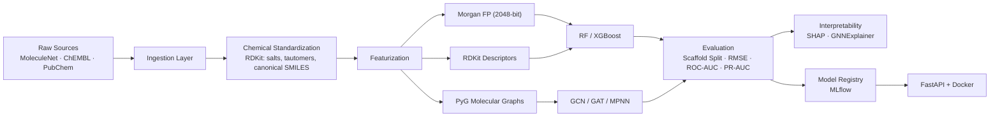

# 🧬 Molecular Property Prediction System

A production-grade, end-to-end machine learning platform for predicting molecular properties from chemical structures. Built as a comprehensive ML engineering portfolio piece demonstrating the full lifecycle—from raw data ingestion to **3D structural analysis** and **interactive dashboard deployment**.

[](https://github.com/jitesh523/Molecular-Property-Prediction-System./actions)
[](https://github.com/jitesh523/Molecular-Property-Prediction-System./actions)
[](https://python.org)
[](http://localhost:8501)
[](LICENSE)
[](docs/PORTFOLIO.md)

---

## 🏗️ Architecture



---

## 📊 Datasets

| Dataset | Source | Task | Molecules | Endpoint |
|---------|--------|------|-----------|----------|
| ESOL (Delaney) | MoleculeNet | Regression | ~1,128 | Aqueous solubility (logS) |
| FreeSolv | MoleculeNet | Regression | ~643 | Hydration free energy |
| Lipophilicity | MoleculeNet | Regression | ~4,200 | Octanol/water partition (logD) |
| BBBP | MoleculeNet | Classification | ~2,039 | Blood-brain barrier permeability |
| ChEMBL EGFR | ChEMBL 36 | Regression | Variable | pIC50 inhibition potency |
| PubChem AID 260895 | PUG-REST | Regression | ~25 | erbB1 inhibition (IC50→pIC50) |

---

## 🖥️ Interactive Exploration Dashboard

The system includes a premium **Streamlit** dashboard for real-time model interaction and chemical space visualization.

### Features:
- **Property Explorer:** Enter any SMILES string to get real-time property predictions.
- **Uncertainty Quantification:** Visual confidence intervals via Monte Carlo Dropout (10 samples).
- **Chemical Space Explorer:** Interactive **UMAP** projection of the dataset (Morgan Fingerprints).
- **Structure Rendering:** High-quality RDKit molecule visualization.

### Run with Docker Compose:
```bash
docker-compose up --build
```
- **API:** `http://localhost:8000`
- **Dashboard:** `http://localhost:8501`

---

## 🤖 Model Zoo

### Baselines (Fingerprint-based)
| Model | Features | Library | Performance |
|-------|----------|---------|-------------|
| **Random Forest** | Morgan FP (2048-bit) | scikit-learn | Strong baseline for small datasets |
| **XGBoost** | Morgan FP (2048-bit) | XGBoost | Best for high-dimensional fingerprints |

### Graph Neural Networks
| Model | Architecture | Library | Purpose |
|-------|-------------|---------|---------|
| **GCN** | Graph Convolutional Network | PyTorch Geometric | Baseline graph connectivity |
| **GAT** | Graph Attention Network | PyTorch Geometric | Attention-based node importance |
| **MPNN** | Message Passing Neural Network | PyTorch Geometric | Edge-conditioned message passing |
| **Multi-Task GNN** | Shared Backbone + Head | PyTorch Geometric | Collaborative learning across tasks |

**Architecture Details:**
- **Backbone:** 3–5 message passing layers (GraphConv/GATConv/MessagePassing).
- **Uncertainty:** MC Dropout active during inference for variance estimation ($ \sigma $).
- **Readout:** Global Mean Pooling → 2-layer MLP Head.

---

## 🚀 Quickstart

### 1. Environment Setup

```bash
# Clone the repository
git clone https://github.com/jitesh523/Molecular-Property-Prediction-System..git
cd Molecular-Property-Prediction-System.

# Setup with Conda (recommended)
conda env create -f environment.yml
conda activate molprop

# Or via Virtualenv
python -m venv .venv
source .venv/bin/activate
pip install -e .
```

### 2. Data Pipeline

```bash
# Download and Standardize benchmark sets
python scripts/download_molnet_datasets.py
python -c "from molprop.data.processor import process_all_benchmark_datasets; from pathlib import Path; process_all_benchmark_datasets(Path('data/raw'), Path('data/processed'))"
```

### 3. Training & Evaluation

```bash
# Train GAT on Blood-Brain Barrier dataset
python scripts/train_gnn.py model=gat dataset=bbbp

# Run Ablation Study
python scripts/run_ablation.py --dataset delaney --task regression
```

### 4. Interactive Dashboard

```bash
streamlit run scripts/portfolio_dashboard.py
```

---

## 📊 Ablation Study

Structured comparison of representation modalities (fingerprints vs descriptors vs graphs vs hybrid).
- **Finding:** GNNs often outperform fingerprints on BBBP due to better handling of spatial connectivity, while Random Forest remains competitive on small solubility datasets (Delaney).

---

## 🔬 Interpretability & Diagnostics

- **Global/Local SHAP:** Explainability for fingerprint-based models.
- **GNNExplainer:** Identifying critical subgraphs (atoms/bonds) for graph-based predictions.
- **Ucertainty (MC Dropout):** Identifying out-of-distribution molecules where predictions are less reliable.
- **Chemical Bias Analysis:** Diagnostic scripts in `scripts/analyze_errors.py` to detect "difficult" chemical scaffolds.

---

## 🛠️ MLOps Stack

| Component | Tool | Industrial Purpose |
|-----------|------|--------------------|
| **Tracking** | MLflow | Lineage of hyperparameters, metrics, and models. |
| **Versioning** | DVC | Git-compatible data and artifact versioning. |
| **Configuration**| Hydra | Composable YAML for reproducible experiments. |
| **Deployment** | Docker | Consistent runtime environments for API/Dashboard. |
| **CI/CD** | Actions | Automated linting (Ruff) and unit testing (Pytest). |

---

## 📁 Repository Structure

```
molprop-prediction/
├── .github/workflows/          # CI + Docker build workflows
├── configs/                    # Hydra YAML configs
├── data/                       # DVC-tracked raw/processed datasets
├── notebooks/                  # Educational walkthrough (00-04)
├── scripts/                    # Training, HPO, and dashboard scripts
├── src/molprop/                # Core source code
├── tests/                      # pytest test suite with coverage
├── results/                    # Benchmarks, ablation, explanations
├── Dockerfile                  # Multi-stage build
├── docker-compose.yml          # Orchestration for API + Dashboard
└── pyproject.toml              # Project metadata & dependencies
```

---

## ✅ Reproducibility Checklist

- [x] **Pinned dependencies** via `pyproject.toml`
- [x] **Deterministic splits** using scaffold-based splitting
- [x] **Canonical standardization** preserving original ↔ standardized SMILES mapping
- [x] **Experiment logging** with MLflow
- [x] **Data versioning** with DVC pipeline definitions
- [x] **Automated CI** with GitHub Actions
- [x] **Containerized inference** via multi-stage Docker builds

---

## 📝 Resume Bullets

> **Built an end-to-end molecular property prediction platform** integrating ChEMBL 36 and PubChem BioAssay (PUG-REST) with benchmark MoleculeNet datasets; implemented deterministic chemical standardization (salt stripping, canonical SMILES, unit normalization) and dataset versioning.

> **Benchmarked RandomForest and XGBoost baselines against GNN architectures** (GCN, GAT, MPNN) in PyTorch Geometric using scaffold-split cross-validation; conducted structured ablation studies (fingerprint vs descriptors vs graph vs hybrid) and reported RMSE/MAE for regression and ROC-AUC/PR-AUC/MCC for imbalanced classification tasks.

> **Implemented multi-task GNN training** with NaN-masked loss functions supporting mixed regression + classification endpoints, enabling simultaneous prediction of physicochemical and ADMET properties from a single shared backbone.

> **Delivered production-ready MLOps**: experiment tracking (MLflow), reproducible environments, CI with coverage reporting, Optuna hyperparameter optimization, and a Dockerized FastAPI inference service with batch prediction, Swagger docs, and explainability artifacts (SHAP + GNNExplainer).

---

## 📄 License

MIT © 2026
